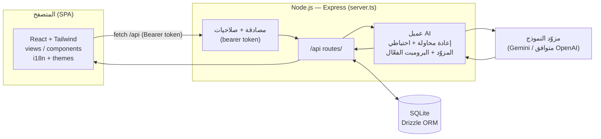

# وثيقة التسليم والتوثيق الشامل — نظام SMART RECRUITMENT SUITE (ATS)

> **نظام تحليل ومطابقة السير الذاتية بالذكاء الاصطناعي** — عربي/إنجليزي (RTL/LTR)، ذاتي الاستضافة، بدون تكلفة سحابية إلزامية.
> هذه الوثيقة هي الوصف العربي المتكامل للمشروع. للتوثيق الإنجليزي راجع [`README.md`](README.md)، ولدليل التشغيل خطوة بخطوة راجع [`INSTALL_AR.md`](INSTALL_AR.md).

## جدول المحتويات
- [نظرة عامة](#نظرة-عامة)
- [الخصائص الوظيفية (بالتفصيل)](#الخصائص-الوظيفية-بالتفصيل)
- [الخصائص غير الوظيفية](#الخصائص-غير-الوظيفية)
- [التقنيات المستخدمة](#التقنيات-المستخدمة)
- [البنية المعمارية](#البنية-المعمارية)
- [هيكل المشروع](#هيكل-المشروع)
- [نموذج البيانات (قاعدة البيانات)](#نموذج-البيانات-قاعدة-البيانات)
- [خط أنابيب تحليل الذكاء الاصطناعي](#خط-أنابيب-تحليل-الذكاء-الاصطناعي)
- [الأدوار والصلاحيات (RBAC)](#الأدوار-والصلاحيات-rbac)
- [مرجع الـ API](#مرجع-الـ-api)
- [تعدد اللغات والثيمات](#تعدد-اللغات-والثيمات)
- [الأمان والخصوصية](#الأمان-والخصوصية)
- [الإعداد والتشغيل](#الإعداد-والتشغيل)
- [النشر للإنتاج](#النشر-للإنتاج)
- [الحسابات التجريبية](#الحسابات-التجريبية)
- [ملاحظات للصيانة والتطوير](#ملاحظات-للصيانة-والتطوير)

---

## نظرة عامة

**SMART RECRUITMENT SUITE** نظام متكامل لتتبّع المتقدمين (ATS) يساعد فرق الموارد البشرية على تقييم المرشحين بموضوعية وسرعة. يُعرّف المستخدم الوظيفة مع **قائمة تحقق منظّمة (ATS Checklist)**، ثم يرفع السير الذاتية (PDF / Word / صورة)، فيستخدم النظام نموذج ذكاء اصطناعي (Google Gemini افتراضياً) لـ **استخراج البيانات من كل سيرة وتقييمها ومطابقتها** مع متطلبات الوظيفة — منتِجاً لوحة متصدّرين مرتّبة، وتقريراً تفصيلياً لكل مرشح، ومقارنات جنباً إلى جنب، وتواصلاً فورياً مع المرشح.

يعمل النظام بالكامل من **عملية Node.js واحدة** مع قاعدة بيانات **SQLite** محلية — بلا قاعدة بيانات خارجية، وبلا خدمات سحابية إلزامية، وبلا ارتباط بمزوّد معيّن. يمكن تشغيله على جهاز شخصي، أو خادم داخلي (24/7 عبر PM2)، أو أي مستضيف يدعم Node.

**مبادئ التصميم**
- **موضوعي ومبني على الأدلة** — النموذج مُلزَم باقتباس دليل حرفي من السيرة، وممنوع اختلاق مهارات أو خبرات.
- **تقليل التحيّز** — وضع **تعمية البيانات (GDPR)** يُخفي الأسماء ومعلومات الاتصال أثناء التقييم.
- **ثنائي اللغة بالتصميم** — كل شاشة تنقلب بين العربية (RTL) والإنجليزية (LTR) بزرّ واحد.
- **تحكّم كامل للمشغّل** — المزوّدون، النماذج، حصة التوكن، قوالب الرسائل، وحتى **برومبتات النظام** كلها قابلة للتعديل من الواجهة.

---

## الخصائص الوظيفية (بالتفصيل)

### 1) المصادقة والجلسات
- تسجيل دخول باسم مستخدم/كلمة مرور مقابل حسابات مُهيّأة مسبقاً؛ الخادم يُصدر **رمز Bearer موقّعاً (HMAC-SHA256)**.
- يُتحقَّق من الرمز في **كل** طلب `/api`؛ والواجهة تُخزّنه وترفقه بكل النداءات.

### 2) لوحة التحكم (Dashboard)
- بطاقات مؤشرات: إجمالي السير المعالجة، الوظائف النشطة، التطابقات الممتازة (≥ 80%)، متوسط نسبة المطابقة.
- **مساعد حسب الدور** يُكيّف الإرشاد حسب صلاحية المستخدم.
- قائمة الوظائف الحالية مع حالتها ومعاينة قائمة التحقق وإجراءات سريعة (عرض/تعديل/نتائج).
- مولّد **«الملخص الاستراتيجي بالذكاء الاصطناعي»** (تجريبي): ملخص أداء + تحليل فجوات + توصيات.
- **نافذة تعديل الوظيفة** لتحديث أي حقل وقائمة التحقق في مكانها.

### 3) تعريف الوظائف (Jobs)
- معلومات أساسية (المسمى، القسم، الموقع، أدنى خبرة، المؤهل) + متطلبات معمّقة (الوصف، المسؤوليات، التخصص، الجنسية، اللغات، الشهادات، متطلبات إضافية).
- **قائمة تحقق ATS**: بنود متطلبات لكل منها **مستوى أهمية** (أساسي / مهم / إضافي) يزنه الذكاء الاصطناعي عند التقييم.

### 4) رفع السير الذاتية والمطابقة (Upload)
- رفع **بالسحب والإفلات** لعدة ملفات (PDF، DOCX/DOC، PNG/JPG). ملفات PDF والصور تُرسَل مباشرةً للنموذج، وملفات Word يُستخرج نصّها في الخادم (`mammoth`).
- **معالجة متوازية دفعية** (3 تحليلات متزامنة) مع تقدّم لكل ملف وشريط تقدّم إجمالي.
- معالجة رشيقة: مفتاح API مفقود/غير صالح يُظهر تحذيراً واضحاً بدل الفشل الصامت؛ الملفات الفاشلة تُبقي سبب الفشل ظاهراً؛ والملفات المكتملة تُتجاوز عند إعادة المحاولة (بلا تكرار للمرشحين).

### 5) لوحة المتصدّرين (Results)
- **صف إحصائيات** — إجمالي السير المعالجة، عدد النتائج المطابقة للفلاتر (ديناميكي)، ومتوسط نسبة المطابقة للنتائج المعروضة.
- **فلاتر متقدمة** — مكوّن **اختيار متعدد قابل للبحث** يُستخدم للمدينة والجنسية والمهارات والمؤهل/التخصص والشهادات؛ كل فلتر يجمع بين **الكتابة اليدوية** و**قيم مُستخرَجة من السير المحمّلة**، ويدعم قيماً متعددة (رقائق/chips) وإضافة قيمة مخصّصة. إضافةً إلى حدّي **أدنى خبرة** / **أدنى مطابقة**، و**بحث نصي حر شامل** في كل بيانات المرشحين. الفلاتر تجمع (OR داخل الفلتر / AND بين الفلاتر) مع زر مسح الكل.
- **جدول مرتّب** — المرشحون مرتّبون تنازلياً حسب المطابقة، مع مؤشر تطابق، وتصنيف (كلي/جزئي/غير مطابق)، وقائمة **حالة الترشيح** المنسدلة (قيد الدراسة/مقبول/مقابلة/مستبعد).
- **إجراءات لكل صف** — مقارنة، تقرير مفصّل، تواصل عبر **واتساب** و**إيميل**، تحميل السيرة الأصلية، إعادة تحليل، حذف.
- **المقارنة** — لوحة مقارنة ثنائية جنباً إلى جنب، ونافذة مقارنة جماعية متعددة الاختيار (نسبة المطابقة، الأبعاد الثلاثية، الحالة، التعليم، الخبرة، المهارات، الفجوات، الشهادات، الجنسية).

### 6) تقرير المرشح المفصّل (Candidate Detail)
- تقرير قابل للطباعة و**التصدير PDF**: مؤشرات دائرية (الإجمالي + تقني/خبرة/ثقافي)، ملخص تنفيذي، نقاط قوة تنافسية، فجوات، سحابة مهارات، شهادات، **الجدول الزمني للتعليم والخبرة**، **جدول مطابقة ATS مرتبط بالأدلة**، وأسئلة مقابلة مقترحة.
- يحترم وضع تعمية GDPR عند تفعيله.

### 7) التواصل مع المرشح (إيميل / واتساب)
- **قوالب رسائل** قابلة للتعديل في الإعدادات (عنوان + نص إيميل، نص واتساب) مع متغيّرات — `{name}` `{job}` `{score}` `{status}` `{degree}` `{experience}` — تُستبدَل لكل مرشح.
- **الإيميل** يفتح برنامج البريد الافتراضي (Outlook مثلاً) برسالة جديدة للمرشح؛ **واتساب** يفتح `wa.me` برقم المرشح. الزرّان معطّلان في وضع GDPR أو عند غياب بيانات التواصل.

### 8) إدارة مزوّدي الذكاء الاصطناعي واستهلاك التوكن
- إدارة **أي عدد من المزوّدين** كجدول (الاسم، النموذج، مفتاح API، رابط خادم اختياري) مع تحديد المزوّد **الفعّال** الذي يقود التحليل، مع رجوع آمن للمفتاح القديم/متغيّر البيئة.
- **قوائم منسدلة مترابطة**: منتقي *مزوّد* (Google Gemini، OpenAI، Anthropic، Azure OpenAI، Mistral، مخصّص) ومنتقي *نموذج* يُملأ حسب المزوّد المختار (مع خيار مخصّص).
- **مؤشر استهلاك التوكن** — استهلاك فعلي تراكمي يُلتقط من كل نداء AI، يُعرض كنسبة من حصة شهرية قابلة للضبط، بشريط ملوّن وزر تصفير. المفاتيح تظهر دائماً **مقنّعة** (`••••`) في المتصفح.

### 9) إدارة برومبتات الذكاء الاصطناعي
- صفحة مخصّصة (`/settings/prompts`) لـ **عرض وتعديل وإنشاء نسخ وتفعيل** برومبتات النظام الفعلية المستخدمة في الخادم (برومبت التحليل/الاستخراج + برومبت إعادة التحليل).
- إنشاء عدة نسخ، تبديل النسخة الفعّالة، حذف النسخ، و**استعادة الافتراضي** بضغطة واحدة. البرومبتات تُحفَظ في SQLite، ونقاط الرفع وإعادة التحليل تستخدم **النسخة الفعّالة** وقت التشغيل.

### 10) تجربة الاستخدام العامة
- **الثيمات** — فاتح، داكن، و«ليلي أصفر» (accent)، مع منتقي لون أساسي بـ 6 عيّنات؛ محفوظة بلا وميض عند التحميل.
- **قائمة جانبية قابلة للطي** بارتفاع كامل (شريط أيقونات)، محفوظة.
- **تعريب كامل** — مبدّل عربي (RTL) / إنجليزي (LTR) في الشريط العلوي وصفحة الدخول، محفوظ، مع انقلاب كامل للتخطيط.

---

## الخصائص غير الوظيفية

| الخاصية | كيف عولِجت |
|---------|-----------|
| **الأمان** | رموز Bearer موقّعة (HMAC-SHA256 عبر `AUTH_SECRET`)؛ صلاحيات مُنفّذة **في الخادم** على كل مسار (وليست مجرد إخفاء في الواجهة)؛ مفاتيح API مخزّنة في الخادم وتُعاد **مقنّعة**؛ كلمات المرور مخزّنة مُجزّأة (hashed). |
| **الخصوصية / الامتثال** | وضع تعمية GDPR يُخفي أسماء المرشحين وبيانات اتصالهم عبر الواجهة والتحميلات والتقارير لتقليل تحيّز المُقيّم. |
| **الأداء** | تحليل دفعي متوازٍ (تزامن محدود)؛ حسابات تقرير وتحليل JSON مُخزّنة مؤقتاً (memoized)؛ ضبط SQLite؛ مهلة زمنية لكل نداء AI لمنع تعليق الرفع؛ بناء إنتاجي مع تقسيم الكود. |
| **الموثوقية والصمود** | نداءات AI بإعادة محاولة و**تراجع أُسّي (backoff)** و**نموذج احتياطي** (رئيسي → أخف)؛ قاعدة عدم الهلوسة؛ تدهور رشيق عند تعذّر AI، ولا يختلق النظام بيانات مرشح أبداً. |
| **قابلية النقل** | عملية Node واحدة + ملف SQLite محلي؛ يعمل على لابتوب/خادم داخلي/Codespaces/أي مستضيف Node؛ بلا DB خارجية أو سحابة إلزامية. |
| **قابلية الصيانة** | TypeScript من الطرف للطرف؛ مخطّط Drizzle مع **ترحيلات تلقائية آمنة (idempotent)**؛ فصل واضح بين `views/` و`components/` و`db/` و`utils/` و`i18n/`؛ برومبتات ومزوّدون قابلون للتعديل بدل التثبيت في الكود. |
| **سهولة الاستخدام والوصول** | ثنائي RTL/LTR، واعٍ للثيم (فاتح/داكن)، قوائم منسدلة صديقة للوحة المفاتيح، أنماط تقرير محسّنة للطباعة/PDF، تخطيط متجاوب. |
| **قابلية المراقبة** | فحوصات `/api/health` و`/api/ai-providers/health-check`؛ سجلات الخادم لإعادة محاولات AI والترحيلات؛ تتبّع حي لاستهلاك التوكن. |
| **التكلفة** | مجاني محلياً؛ التكلفة الاختيارية الوحيدة هي توكنات AI (الحصة المجانية من Gemini تكفي للاستخدام الخفيف). |

---

## التقنيات المستخدمة

**الواجهة الأمامية** — React 19 · TypeScript · Vite 6 · Tailwind CSS v4 (ثيم بمتغيّرات CSS) · React Router 7 · lucide-react (أيقونات) · motion (حركات).

**الواجهة الخلفية** — Node.js · Express 4 · better-sqlite3 · Drizzle ORM · Multer (رفع) · Mammoth (استخراج نص DOCX) · `@google/genai` (Gemini) · Node `crypto` (مصادقة + تجزئة).

**أدوات** — tsx (تشغيل التطوير) · esbuild (تجميع الخادم) · drizzle-kit · فحص TypeScript `--noEmit`.

> **ملاحظة:** توجد `firebase` / `firebase-admin` في `package.json` كبقايا من قالب AI Studio الأصلي لكنها **غير مستخدمة** — فالمصادقة نظام رموز ذاتي، والتخزين محلي عبر SQLite.

---

## البنية المعمارية

خادم Express واحد يخدم الـ API والواجهة معاً. في التطوير يُضمّن Vite كوسيط، وفي الإنتاج يخدم ملفات ثابتة مبنية مسبقاً. كل نداءات AI تمرّ عبر الخادم بحيث **لا تصل مفاتيح API إلى المتصفح أبداً**.



**تدفّق طلب التحليل:** رفع → مصادقة/صلاحيات → تحديد المزوّد والبرومبت الفعّالين → إرسال السيرة (PDF/صورة مباشرةً أو نص مُستخرَج) للنموذج → تحليل وإصلاح JSON → حفظ المرشح → إرجاع النتيجة المنظّمة → تسجيل استهلاك التوكن.

---

## هيكل المشروع

```
CV-analyzer-light/
├── server.ts                 # خادم Express: API، مصادقة/صلاحيات، خط AI، ترحيلات، تهيئة
├── src/
│   ├── main.tsx              # نقطة دخول React
│   ├── App.tsx               # الموجّه + القشرة (قائمة جانبية قابلة للطي، المزوّدات)
│   ├── index.css             # Tailwind + جسر الثيم + أنماط الطباعة
│   ├── theme-tokens.css      # توكنات تصميم فاتح/داكن/accent
│   ├── prompts.ts            # برومبتات النظام الافتراضية المدمجة
│   ├── views/                # الشاشات
│   │   ├── Login.tsx  Dashboard.tsx  Jobs.tsx  Upload.tsx
│   │   ├── Results.tsx        # لوحة المتصدّرين (فلاتر، إحصائيات، مقارنة، تواصل)
│   │   ├── CandidateDetail.tsx
│   │   ├── Settings.tsx       # مزوّدو AI، استهلاك التوكن، قوالب الرسائل
│   │   └── PromptSettings.tsx # محرّر نسخ البرومبت
│   ├── components/           # TopNavbar، MultiSelectFilter، ProviderModelFields،
│   │                         # LaserUploadZone، DynamicLoadingSpinner، ProtectedRoute
│   ├── context/RoleContext.tsx   # حالة المصادقة + الدور + GDPR
│   ├── db/                   # schema.ts (Drizzle)، index.ts (better-sqlite3)
│   ├── i18n/                 # I18nContext + قواميس عربي→إنجليزي
│   └── utils/                # api.ts، rbac.ts، gdpr.ts، theme.ts، aiCatalog.ts
├── scripts/                  # run.sh/.bat (تطوير) · start-prod.sh/.bat (إنتاج)
├── ecosystem.config.cjs      # إعداد PM2 للتشغيل الدائم 24/7
├── sqlite.db                 # قاعدة البيانات المحلية (تُنشأ/تُهيّأ تلقائياً)
├── INSTALL_AR.md             # دليل التثبيت العربي خطوة بخطوة
└── README.md                 # التوثيق الإنجليزي الكامل
```

---

## نموذج البيانات (قاعدة البيانات)

SQLite عبر Drizzle ORM. المخطّط في `src/db/schema.ts`، و**الترحيلات الآمنة** تعمل عند كل إقلاع فتُحدَّث قواعد البيانات القائمة تلقائياً.

| الجدول | الغرض | أعمدة رئيسية |
|-------|------|-------------|
| `users` | الحسابات والأدوار | `username`، `password_hash`، `role` |
| `settings` | إعداد مفرد | مفاتيح AI، قوالب الرسائل (`email_subject/body`، `whatsapp_message`)، `token_quota`، `tokens_used`، `active_provider_id` |
| `jobs` | تعريفات الوظائف | المسمى، القسم، الموقع، الخبرة، المؤهل، المهارات، `checklist` (JSON) … |
| `candidates` | السير المحلَّلة | `name`، `match_score`، الأبعاد الثلاثية، `skills`/`gaps`/`checklist_eval`/`experience_timeline`/`certifications_list` (JSON)، التواصل، `status`، `gdpr_anonymized` |
| `ai_providers` | المزوّدون القابلون للضبط | `provider_name`، `model_name`، `api_key`، `base_url`، `is_active` |
| `ai_prompts` | نسخ البرومبت | `name`، `analysis_prompt`، `reanalysis_prompt`، `is_active` |

---

## خط أنابيب تحليل الذكاء الاصطناعي

1. **تحديد** المزوّد الفعّال (النموذج + المفتاح + رابط اختياري) والبرومبت الفعّال من قاعدة البيانات (مع رجوع لمفتاح البيئة/الافتراضي).
2. **تجهيز المدخلات** — PDF والصور تُرسَل مباشرةً (base64)، وملفات Word تُستخرَج نصاً، إضافةً إلى متطلبات الوظيفة (JSON).
3. **نداء النموذج** بتعليمات صارمة مبنية على الأدلة ومانعة للهلوسة، مع مخطّط استجابة JSON.
4. **الصمود** — إعادة محاولة بتراجع أُسّي؛ وعند تكرار الفشل، التراجع لنموذج أخف.
5. **تحليل وإصلاح** JSON العائد (منظّف متسامح) → توحيد → حفظ المرشح.
6. **تسجيل استهلاك التوكن** (من بيانات استخدام النموذج) مقابل الحصة الشهرية.

البرومبتات **قابلة للتعديل والإصدار** من صفحة إدارة البرومبتات، و«استعادة الافتراضي» ترجع للمدمجة في `src/prompts.ts`.

---

## الأدوار والصلاحيات (RBAC)

مُنفّذة في الواجهة (حُرّاس المسارات + إخفاء العناصر) **وفي الخادم** (كل مسار `/api` يفحص الرمز والدور).

| القدرة | Admin | Hiring Manager | Recruiter |
|-------|:-----:|:--------------:|:---------:|
| عرض اللوحة والنتائج | ✅ | ✅ | ✅ |
| تعريف/تعديل الوظائف | ✅ | ➖ | ✅ |
| رفع وتحليل السير | ✅ | ➖ | ✅ |
| تغيير حالة المرشح | ✅ | ✅ | ➖ |
| حذف المرشحين/الوظائف | ✅ | ➖ | ➖ |
| إعدادات AI والمزوّدون والبرومبتات والمفاتيح | ✅ | ➖ | ➖ |
| تبديل وضع GDPR | ✅ | ✅ | ➖ |

*(المصفوفة الدقيقة في `src/utils/rbac.ts` وحُرّاس `requireRole` في الخادم.)*

---

## مرجع الـ API

كل المسارات تتطلّب `Authorization: Bearer <token>` صالحاً ما لم يُذكر خلاف ذلك؛ ومسارات المدير مؤشّرة بـ 🔒.

**المصادقة والفحص** — `POST /api/auth/login` · `GET /api/auth/me` · `GET /api/health` (عام)

**الوظائف** — `GET /api/jobs` · `GET /api/jobs/:id` · `POST /api/jobs` · `PUT /api/jobs/:id` · `DELETE /api/jobs/:id`

**المرشحون** — `GET /api/candidates` · `GET /api/candidates/:id` · `POST /api/candidates` · `PUT /api/candidates/:id` · `DELETE /api/candidates/:id` · `GET /api/candidates/:id/download` · `POST /api/candidates/:id/reanalyze`

**التحليل** — `POST /api/upload` (رفع سيرة → تحليل AI) · `GET /api/dashboard/stats`

**الإعدادات والرسائل** — `GET/PUT /api/settings` 🔒 · `GET /api/message-templates`

**مزوّدو AI** 🔒 — `GET/POST /api/ai-providers` · `PUT/DELETE /api/ai-providers/:id` · `POST /api/ai-providers/:id/activate` · `POST /api/test-connection`

**استهلاك التوكن** 🔒 — `GET /api/token-usage` · `POST /api/token-usage/reset`

**البرومبتات** 🔒 — `GET /api/prompts` · `GET /api/prompts/defaults` · `POST /api/prompts` · `PUT/DELETE /api/prompts/:id` · `POST /api/prompts/:id/activate` · `POST /api/prompts/restore-defaults`

---

## تعدد اللغات والثيمات

- **ثنائي اللغة (عربي/إنجليزي)** مع انقلاب تلقائي **RTL ↔ LTR**. مبدّل اللغة في الشريط العلوي وصفحة الدخول، والاختيار محفوظ ويُطبَّق قبل أول رسم (بلا وميض). القواميس في `src/i18n/`. البيانات التي يكتبها المستخدم أو ينتجها AI (مسميات الوظائف، بنود القائمة، حالات المرشح) تبقى بلغتها الأصلية عمداً — الترجمة للواجهة فقط.
- **الثيمات** — فاتح/داكن/«ليلي أصفر» عبر متغيّرات CSS (`src/theme-tokens.css`) مع جسر Tailwind، ومنتقي لون أساسي بـ 6 عيّنات. الكل محفوظ في `localStorage`.

---

## الأمان والخصوصية

- **المصادقة** — كلمات المرور مُجزّأة؛ الدخول يُرجع رمزاً موقّعاً (HMAC-SHA256) يُتحقَّق منه في كل طلب.
- **التفويض** — `requireRole` في الخادم على كل مسار حسّاس؛ وحُرّاس الواجهة للراحة فقط.
- **الأسرار** — مفاتيح AI في الخادم وتُعاد دائماً **مقنّعة** (`••••1234`)؛ والقيمة المقنّعة المُعادة عند الحفظ تُتجاهل حتى لا يُمحى المفتاح الحقيقي.
- **تعمية GDPR** — مفتاح عام يُخفي الأسماء وبيانات الاتصال عبر الواجهة والمقارنات والتقارير، ويمنع تحميل الملف الأصلي أثناء التفعيل.
- ⚠️ **قبل أي نشر حقيقي:** اضبط `AUTH_SECRET` قوياً، وغيّر كلمات المرور التجريبية، وقيّد التعرّض الشبكي.

---

## الإعداد والتشغيل

**المتطلبات:** Node.js **22.5 أو أحدث** — طبقة قاعدة البيانات تستخدم وحدة `node:sqlite`
المدمجة، وهي غير موجودة في الإصدارات الأقدم.

```bash
# 1) تثبيت الاعتماديات
npm install

# 2) الإعداد (اختياري للـ AI): انسخ المثال واضبط المفاتيح
cp .env.example .env.local   # ثم عدّل GEMINI_API_KEY / AUTH_SECRET

# 3) التشغيل (تطوير — Vite + API على منفذ واحد)
npm run dev
# افتح http://localhost:3000
```

سكربتات جاهزة (تثبيت + تشغيل تلقائي): `scripts/run.sh` (ماك/لينكس) أو `scripts/run.bat` (ويندوز).
لدليل عربي كامل بلا إنترنت راجع [`INSTALL_AR.md`](INSTALL_AR.md).

**GitHub Codespaces:** يوجد [`.devcontainer`](.devcontainer/devcontainer.json) — افتح المستودع في Codespace، انتظر `npm install`، شغّل `npm run dev`، وافتح المنفذ 3000.

---

## النشر للإنتاج

```bash
npm run build     # يبني الواجهة (dist/) ويجمّع الخادم (dist/server.cjs)
npm start         # يشغّل خادم الإنتاج
```

**تشغيل دائم 24/7 عبر PM2** (راجع `ecosystem.config.cjs`):

```bash
npm run build
npm install -g pm2
pm2 start ecosystem.config.cjs
pm2 save && pm2 startup     # تشغيل تلقائي عند الإقلاع
```

النظام عملية Node واحدة؛ خُذ نسخة احتياطية من `sqlite.db` للحفاظ على كل البيانات. قابل للنشر على أي مستضيف يدعم Node (VM، خادم داخلي، حاوية…).

---

## الحسابات التجريبية

تُهيّأ تلقائياً عند أول تشغيل. **غيّرها قبل أي نشر حقيقي.**

| المستخدم | كلمة المرور | الدور |
|----------|-------------|------|
| `admin` | `admin123` | مدير النظام (Admin) |
| `manager` | `manager123` | مدير التوظيف (Hiring Manager) |
| `recruiter` | `recruiter123` | مسؤول التوظيف (Recruiter) |

---

## ملاحظات للصيانة والتطوير

- **قاعدة البيانات:** تُخزَّن محلياً في `sqlite.db`. لإضافة أعمدة/جداول جديدة: حدّث `src/db/schema.ts` وأضِف سطر ترحيل idempotent في `migrateDatabase()` داخل `server.ts` (يعمل تلقائياً عند الإقلاع).
- **تطوير الواجهة:** الشاشات في `src/views/`، والمكونات القابلة لإعادة الاستخدام في `src/components/`، ونصوص الواجهة تُضاف كمفاتيح في `src/i18n/`.
- **الذكاء الاصطناعي:** لتغيير المزوّد/النموذج استخدم صفحة الإعدادات (بلا تعديل كود)، ولتغيير سلوك التحليل عدّل البرومبتات من صفحة إدارة البرومبتات، أو المدمجة في `src/prompts.ts`.
- **الاستضافة:** أي مزوّد يدعم Node.js؛ للتشغيل الدائم استخدم PM2 كما بالأعلى.
- **التحقق:** `npm run lint` (فحص أنواع TypeScript) و`npm run build` قبل أي نشر.
