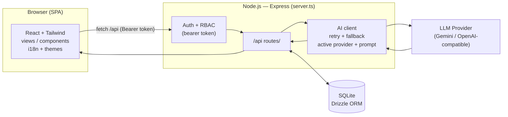

<div align="center">

# 🧠 Smart Recruitment Suite — CV Analyzer

**AI-powered Applicant Tracking System (ATS) for analyzing, scoring, and matching CVs against job requirements.**

Arabic-first · Fully bilingual (AR / EN, RTL / LTR) · Self-hosted · Zero mandatory cloud cost

</div>

---

## 📖 Table of Contents

- [Overview](#-overview)
- [Feature Highlights](#-feature-highlights)
- [Functional Features (Detailed)](#-functional-features-detailed)
- [Non-Functional Characteristics](#-non-functional-characteristics)
- [Technology Stack](#-technology-stack)
- [Architecture](#-architecture)
- [Project Structure](#-project-structure)
- [Data Model](#-data-model)
- [AI Analysis Pipeline](#-ai-analysis-pipeline)
- [Roles & Access Control (RBAC)](#-roles--access-control-rbac)
- [API Reference](#-api-reference)
- [Internationalization & Theming](#-internationalization--theming)
- [Security & Privacy](#-security--privacy)
- [Configuration](#-configuration-environment-variables)
- [Getting Started](#-getting-started)
- [Production Deployment](#-production-deployment)
- [Demo Accounts](#-demo-accounts)
- [Troubleshooting](#-troubleshooting)

---

## 🎯 Overview

**Smart Recruitment Suite** is a complete, self-contained recruitment platform that helps HR teams evaluate candidates objectively and quickly. Recruiters define a job with a structured **ATS checklist**, upload candidate CVs (PDF, Word, or image), and the system uses a Large Language Model (Google Gemini by default) to **parse each CV, extract structured data, and score it** against the job's requirements — producing a ranked leaderboard, a detailed per-candidate report, side-by-side comparisons, and one-click candidate outreach.

The entire system runs from **a single Node.js process** backed by a local **SQLite** database — no external database, no mandatory cloud services, and no vendor lock-in. It can run on a laptop, an on-prem server (24/7 via PM2), or any Node-capable host.

**Design principles**

- **Objective & evidence-based** — the AI must quote literal evidence from the CV; it is instructed to never hallucinate skills or experience.
- **Bias reduction** — a built-in **GDPR anonymization mode** masks names and contact details during evaluation.
- **Bilingual by design** — every screen mirrors between Arabic (RTL) and English (LTR) with a single toggle.
- **Operator control** — API providers, models, token budgets, message templates, and even the AI system prompts are all editable from the UI.

---

## ✨ Feature Highlights

| Area | Highlights |
|------|-----------|
| **AI analysis** | CV parsing (PDF/DOCX/image) → match score, 3-dimensional scores, skills, gaps, ATS checklist evaluation, experience timeline, certifications, suggested interview questions, and an executive recommendation. |
| **Leaderboard** | Searchable multi-select filters, free-text global search, live statistics, inline status management, dual & bulk comparison, per-row Email/WhatsApp outreach. |
| **Candidate report** | Printable / export-to-PDF profile with circular score gauges, evidence-linked checklist, and timeline. |
| **AI configuration** | Manage multiple AI providers, pick the active one, dependent Provider→Model dropdowns, live token-usage meter with quota. |
| **Prompt management** | View, edit, version, activate, and restore the actual system prompts the backend uses. |
| **Experience** | Light / Dark / "Midnight Yellow" themes + primary-color picker, collapsible sidebar, full AR/EN localization. |
| **Security** | Token auth, server-side RBAC on every route, redacted API keys, GDPR anonymization. |

---

## 🧩 Functional Features (Detailed)

### 1. Authentication & Sessions
- Username/password login against seeded users; the server issues a signed **HMAC-SHA256 bearer token**.
- The token is validated on **every** `/api` request; the UI stores it and attaches it to all calls.
- Three roles are seeded automatically (see [Demo Accounts](#-demo-accounts)).

### 2. Dashboard
- KPI cards: total processed CVs, active jobs, excellent matches (≥ 80 %), average match score.
- A **role-based assistant** panel that adapts guidance to the signed-in role.
- Current jobs list with inline status, ATS-checklist preview, and quick actions (view / edit / results).
- A demo **"AI Strategic Summary"** generator (performance summary, gap analysis, recommendations).
- An **edit-job modal** to update any job field and its checklist in place.

### 3. Job Definition
- Basic info (title, department, location, min. experience, degree) + deep requirements (description, responsibilities, specialization, nationality, languages, certifications, additional requirements).
- **ATS Evaluation Checklist**: a list of requirement items, each with an **importance level** (Mandatory / Important / Additional) that the AI weighs when scoring.

### 4. CV Upload & Matching
- **Drag-and-drop** multi-file upload (PDF, DOCX/DOC, PNG/JPG). PDFs & images are sent inline to the model; Word files are text-extracted server-side (`mammoth`).
- **Parallel batch processing** (3 concurrent analyses) with per-file progress and an overall progress bar.
- Graceful handling: a missing/invalid API key surfaces a clear warning instead of failing silently; failed files keep their reason visible; already-completed files are skipped on retry (no duplicate candidates).

### 5. Leaderboard (Results)
- **Statistics row** — total processed CVs, count matching the active filters (dynamic), and average match score of the shown set.
- **Advanced filters** — a reusable **searchable multi-select combobox** used for **City, Nationality, Skills, Degree/Specialization, Certifications**; each combines manual entry with values *extracted from the loaded CVs*, supports multiple values (chips), and an add-custom option. Plus **min-experience** / **min-match** thresholds and a **free-text global search** across all candidate data. Filters combine OR-within-a-filter / AND-across-filters, with a one-click clear-all.
- **Ranked table** — candidates sorted by match score, with a match-indicator bar, classification (Full / Partial / Unmatched), and an inline **status dropdown** (Pending / Shortlisted / Interviewing / Rejected).
- **Per-row actions** — Compare, detailed Report, **WhatsApp** & **Email** outreach, Download original CV, Re-analyze, Delete.
- **Comparison** — a side-by-side dual comparison panel and a bulk multi-select comparison modal (match score, 3D scores, status, education, experience, skills, gaps, certifications, nationality).

### 6. Candidate Detail Report
- Printable / **export-to-PDF** report: circular gauges (overall + Technical/Experience/Cultural), executive summary, competitive strengths, identified gaps, extracted skills cloud, certifications, **education & experience timeline**, an **evidence-linked ATS matching table**, and suggested interview questions.
- Respects GDPR anonymization when active.

### 7. Candidate Outreach (Email / WhatsApp)
- Editable **message templates** in Settings (email subject + body, WhatsApp text) with placeholders — `{name}`, `{job}`, `{score}`, `{status}`, `{degree}`, `{experience}` — substituted per candidate.
- **Email** opens the OS default mail client (e.g., Outlook) as a new message to the candidate; **WhatsApp** opens `wa.me` with the candidate's number. Both are disabled under GDPR mode or when contact info is missing.

### 8. AI Provider Management & Token Usage
- Manage **any number of AI providers** as a table (name, model, API key, optional server URL); mark one **active** — it drives analysis/matching, with a graceful fallback to the legacy key / environment variable.
- **Dependent dropdowns**: an *AI Provider* selector (Google Gemini, OpenAI, Anthropic, Azure OpenAI, Mistral, Custom) and an *AI Model* selector populated from the chosen provider (with a Custom option).
- **Token-usage meter** — real cumulative token consumption captured from every AI call, shown as a percentage of a configurable monthly quota, with a colored bar and a reset control. API keys are always **redacted** (`••••`) to the browser.

### 9. AI Prompt Management
- A dedicated page (`/settings/prompts`) to **view, edit, version, and activate** the actual system prompts the backend uses (Analysis/Extraction prompt + Re-analysis prompt).
- Create multiple versions, switch the active one, delete versions, and **restore the built-in defaults** in one click. Prompts persist in SQLite; the upload & re-analysis endpoints resolve the **active** prompt at runtime.

### 10. Cross-cutting UX
- **Themes** — Light, Dark, and "Midnight Yellow" (accent), plus a 6-swatch primary-color picker; persisted with no flash on load.
- **Collapsible full-height sidebar** (icon-only rail), persisted.
- **Full localization** — Arabic (RTL) / English (LTR) toggle in the top bar and on the login screen, persisted, with the whole layout mirroring correctly.

---

## 🛡 Non-Functional Characteristics

| Attribute | How it is addressed |
|-----------|--------------------|
| **Security** | Signed bearer tokens (HMAC-SHA256, `AUTH_SECRET`); RBAC enforced **server-side** on every route (not just hidden in the UI); API keys stored server-side and returned **redacted**; passwords stored hashed. |
| **Privacy / Compliance** | GDPR anonymization mode masks candidate names & contact details across the UI, downloads, and reports to reduce evaluator bias. |
| **Performance** | Parallel batch CV analysis (bounded concurrency); memoized report computations & JSON parsing; SQLite tuning; per-request AI timeouts to avoid hung uploads; Vite production build with code-splitting. |
| **Reliability / Resilience** | AI calls use **retry with exponential backoff** and a **model fallback** (primary → lighter model); zero-hallucination rule; the app degrades gracefully when AI is unavailable and never fabricates candidate data. |
| **Portability** | Single Node process + local SQLite file; runs on laptop, on-prem server, Codespaces, or any Node host; no external DB or mandatory cloud. |
| **Maintainability** | TypeScript end-to-end; Drizzle ORM schema with **idempotent auto-migrations**; clear `views/` / `components/` / `db/` / `utils/` / `i18n/` separation; editable prompts & providers instead of hard-coding. |
| **Usability & Accessibility** | Bilingual RTL/LTR, theme-aware (light/dark), keyboard-friendly comboboxes, print/PDF-optimized report styles, responsive layout. |
| **Observability** | Health (`/api/health`) & AI-status (`/api/ai-status`) probes; server logs for AI retries/fallbacks and migrations; live token-usage tracking. |
| **Cost** | Runs free locally; the only optional cost is AI tokens (the Gemini free tier is sufficient for light use). |

---

## 🧱 Technology Stack

**Frontend** — React 19 · TypeScript · Vite 6 · Tailwind CSS v4 (CSS-variable theming) · React Router 7 · lucide-react (icons) · motion (animation).

**Backend** — Node.js · Express 4 · better-sqlite3 · Drizzle ORM · Multer (uploads) · Mammoth (DOCX text extraction) · `@google/genai` (Gemini) · Node `crypto` (auth + hashing).

**Tooling** — tsx (dev runner) · esbuild (server bundle) · drizzle-kit · TypeScript `--noEmit` lint.

> **Note:** `firebase` / `firebase-admin` appear in `package.json` as leftovers from the original AI-Studio template but are **not used** — authentication is a self-contained token system and storage is local SQLite.

---

## 🏗 Architecture

A single Express server serves both the API and the frontend. In development it embeds Vite as middleware; in production it serves the pre-built static assets. All AI calls are proxied through the server so **API keys never reach the browser**.



**Request flow (CV analysis):** upload → auth/RBAC → resolve active provider + active prompt → send CV (inline PDF/image or extracted text) to the model → parse & repair JSON → persist candidate → return structured result → token usage recorded.

---

## 📂 Project Structure

```
CV-analyzer-light/
├── server.ts                 # Express server: API, auth/RBAC, AI pipeline, migrations, seeding
├── src/
│   ├── main.tsx              # React entry
│   ├── App.tsx               # Router + shell (collapsible sidebar, providers)
│   ├── index.css             # Tailwind + theme bridge + print styles
│   ├── theme-tokens.css      # Light/Dark/Accent design tokens
│   ├── prompts.ts            # Built-in default AI system prompts
│   ├── views/                # Screens
│   │   ├── Login.tsx  Dashboard.tsx  Jobs.tsx  Upload.tsx
│   │   ├── Results.tsx        # Leaderboard (filters, stats, comparison, outreach)
│   │   ├── CandidateDetail.tsx
│   │   ├── Settings.tsx       # AI providers, token usage, message templates
│   │   └── PromptSettings.tsx # Prompt versions editor
│   ├── components/           # TopNavbar, MultiSelectFilter, ProviderModelFields,
│   │                         # LaserUploadZone, DynamicLoadingSpinner, ProtectedRoute
│   ├── context/RoleContext.tsx   # Auth + role + GDPR state
│   ├── db/                   # schema.ts (Drizzle), index.ts (better-sqlite3)
│   ├── i18n/                 # I18nContext + AR→EN dictionaries (translations/pages/pages2)
│   └── utils/                # api.ts, rbac.ts, gdpr.ts, theme.ts, aiCatalog.ts
├── scripts/                  # run.sh/.bat (dev) · start-prod.sh/.bat (prod)
├── ecosystem.config.cjs      # PM2 config for 24/7 hosting
├── sqlite.db                 # Local database (auto-created/seeded)
├── INSTALL_AR.md             # Step-by-step Arabic install guide
└── HANDOVER.md               # Full Arabic project documentation
```

---

## 🗄 Data Model

SQLite via Drizzle ORM. The schema lives in `src/db/schema.ts`; **idempotent migrations** run on every startup, so existing databases auto-upgrade.

| Table | Purpose | Key columns |
|-------|---------|-------------|
| `users` | Accounts & roles | `username`, `password_hash`, `role` |
| `settings` | Singleton config | AI keys, message templates (`email_subject/body`, `whatsapp_message`), `token_quota`, `tokens_used`, `active_provider_id` |
| `jobs` | Job definitions | title, department, location, experience, degree, skills, `checklist` (JSON) … |
| `candidates` | Analyzed CVs | `name`, `match_score`, 3D scores, `skills`/`gaps`/`checklist_eval`/`experience_timeline`/`certifications_list` (JSON), contact, `status`, `gdpr_anonymized` |
| `ai_providers` | Configurable providers | `provider_name`, `model_name`, `api_key`, `base_url`, `is_active` |
| `ai_prompts` | Prompt versions | `name`, `analysis_prompt`, `reanalysis_prompt`, `is_active` |

---

## 🤖 AI Analysis Pipeline

1. **Resolve** the active provider (model + key + optional base URL) and the active system prompt from the DB (fallback to the env key / built-in defaults).
2. **Prepare input** — PDFs & images are sent inline (base64); Word docs are extracted to text; plus the job requirements JSON.
3. **Call the model** with strict, evidence-based, anti-hallucination instructions and a JSON response schema.
4. **Resilience** — retry with exponential backoff; on repeated failure, fall back to a lighter model.
5. **Parse & repair** the returned JSON (tolerant cleaner) → normalize → persist the candidate.
6. **Record token usage** (from the model's usage metadata) against the monthly quota.

The exact prompts are **editable and versioned** from the Prompt Management page; "Restore defaults" reverts to the built-ins in `src/prompts.ts`.

---

## 👥 Roles & Access Control (RBAC)

Enforced in the UI (route guards + hidden controls) **and** on the server (every `/api` route checks the token and role).

| Capability | Admin | Hiring Manager | Recruiter |
|-----------|:-----:|:--------------:|:---------:|
| View dashboard & results | ✅ | ✅ | ✅ |
| Define / edit jobs | ✅ | ➖ | ✅ |
| Upload & analyze CVs | ✅ | ➖ | ✅ |
| Change candidate status | ✅ | ✅ | ➖ |
| Delete candidates / jobs | ✅ | ➖ | ➖ |
| AI settings, providers, prompts, API keys | ✅ | ➖ | ➖ |
| Toggle GDPR mode | ✅ | ✅ | ➖ |

*(The exact matrix lives in `src/utils/rbac.ts` and the server's `requireRole` guards.)*

---

## 🔌 API Reference

All routes require a valid `Authorization: Bearer <token>` unless noted; Admin-only routes are marked 🔒.

**Auth & health**
`POST /api/auth/login` · `GET /api/auth/me` · `GET /api/health` (public) · `GET /api/ai-status`

**Jobs** — `GET /api/jobs` · `GET /api/jobs/:id` · `POST /api/jobs` · `PUT /api/jobs/:id` · `DELETE /api/jobs/:id`

**Candidates** — `GET /api/candidates` · `GET /api/candidates/:id` · `POST /api/candidates` · `PUT /api/candidates/:id` · `DELETE /api/candidates/:id` · `GET /api/candidates/:id/download` · `POST /api/candidates/:id/reanalyze`

**Analysis** — `POST /api/upload` (multipart CV → AI analysis) · `GET /api/dashboard/stats`

**Settings & messaging** — `GET/PUT /api/settings` 🔒 · `GET /api/message-templates`

**AI providers** 🔒 — `GET/POST /api/ai-providers` · `PUT/DELETE /api/ai-providers/:id` · `POST /api/ai-providers/:id/activate` · `POST /api/test-connection`

**Token usage** 🔒 — `GET /api/token-usage` · `POST /api/token-usage/reset`

**Prompts** 🔒 — `GET /api/prompts` · `GET /api/prompts/defaults` · `POST /api/prompts` · `PUT/DELETE /api/prompts/:id` · `POST /api/prompts/:id/activate` · `POST /api/prompts/restore-defaults`

---

## 🌍 Internationalization & Theming

- **Bilingual (AR / EN)** with automatic **RTL ↔ LTR** mirroring. The language toggle lives in the top bar and on the login screen; the choice is persisted and applied before first paint (no flash). Dictionaries: `src/i18n/`. User/AI-authored **data** (job titles, checklist content, candidate statuses) intentionally stays in its original language — only the UI chrome is translated.
- **Themes** — Light / Dark / "Midnight Yellow", driven by CSS variables (`src/theme-tokens.css`) with a Tailwind bridge, plus a 6-swatch primary-color picker. All persisted via `localStorage`.

---

## 🔐 Security & Privacy

- **Authentication** — passwords are hashed; login returns an HMAC-SHA256 signed token validated on every request.
- **Authorization** — server-side `requireRole` on every mutating/admin route; the UI guards are convenience only.
- **Secrets** — AI keys live server-side and are always returned **redacted** (`••••1234`); a redacted value echoed back on save is ignored so the real key is never wiped.
- **GDPR anonymization** — a global toggle masks names & contact info across the UI, comparisons, reports, and blocks original-file downloads while active.
- ⚠️ **Before any real deployment:** set a strong `AUTH_SECRET`, change the seeded demo passwords, and restrict network exposure.

---

## ⚙️ Configuration (Environment Variables)

Create a `.env.local` (see [`.env.example`](.env.example)):

| Variable | Required | Purpose |
|----------|----------|---------|
| `GEMINI_API_KEY` | For AI analysis | Default Gemini key (can also be set per-provider in the UI). |
| `AUTH_SECRET` | Production | Secret for signing auth tokens — **use a long random value**. |
| `APP_URL` | Optional | Public URL for self-referential links. |
| `PORT` | Optional | Server port (defaults to `3000`). |

---

## 🚀 Getting Started

**Prerequisites:** Node.js 18+.

```bash
# 1. Install dependencies
npm install

# 2. Configure (optional for AI): copy the example and set your keys
cp .env.example .env.local   # then edit GEMINI_API_KEY / AUTH_SECRET

# 3. Run (dev — Vite middleware + API on one port)
npm run dev
# open http://localhost:3000
```

Convenience scripts (auto-install + run): `scripts/run.sh` (macOS/Linux) or `scripts/run.bat` (Windows).
For a **fully offline, step-by-step Arabic guide**, see [`INSTALL_AR.md`](INSTALL_AR.md).

**GitHub Codespaces:** a [`.devcontainer`](.devcontainer/devcontainer.json) is included — open the repo in a Codespace, wait for `npm install`, run `npm run dev`, and open the forwarded port `3000`.

---

## 📦 Production Deployment

```bash
npm run build     # builds the SPA (dist/) and bundles the server (dist/server.cjs)
npm start         # runs the production server
```

**24/7 hosting with PM2** (see `ecosystem.config.cjs`):

```bash
npm run build
npm install -g pm2
pm2 start ecosystem.config.cjs
pm2 save && pm2 startup     # auto-start on boot
```

The app is a single Node process; back up `sqlite.db` to preserve all data. Deployable to any Node-capable host (VM, on-prem server, container, etc.).

---

## 🔑 Demo Accounts

Seeded automatically on first run. **Change these before any real deployment.**

| Username    | Password       | Role            |
|-------------|----------------|-----------------|
| `admin`     | `admin123`     | Admin           |
| `manager`   | `manager123`   | Hiring Manager  |
| `recruiter` | `recruiter123` | Recruiter       |

---

## 🩺 Troubleshooting

| Symptom | Fix |
|---------|-----|
| "Gemini API key not configured" warning on upload | Add a key in **Settings → AI Providers** (mark it active) or set `GEMINI_API_KEY`. |
| Analysis fails / times out | Check the key & quota; the server auto-retries and falls back to a lighter model — see the server logs. |
| Login fails | Use the demo accounts above; ensure the server started (it seeds users on first run). |
| Data "reset" | All data lives in `sqlite.db`; don't delete it, and back it up. |
| Wrong language / direction | Toggle language from the top bar; the choice persists in the browser. |

---

<div align="center">

**Smart Recruitment Suite** — built for objective, fast, bilingual hiring.
Full Arabic documentation: [`HANDOVER.md`](HANDOVER.md) · Offline install: [`INSTALL_AR.md`](INSTALL_AR.md)

</div>
